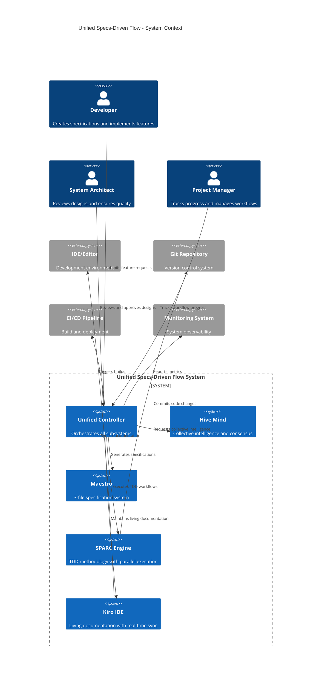
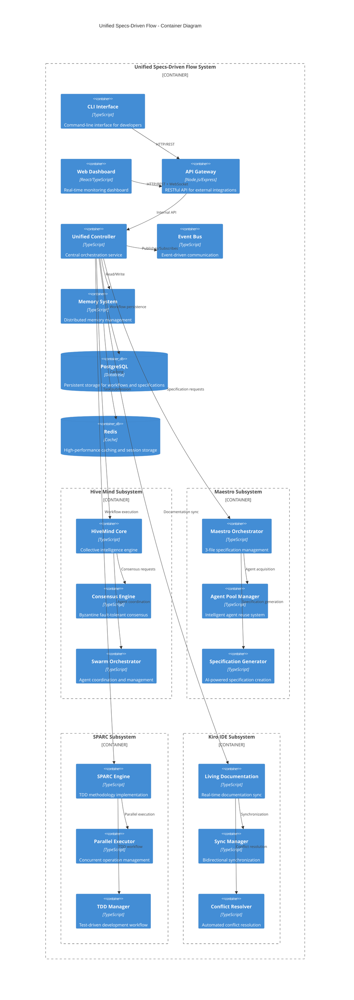
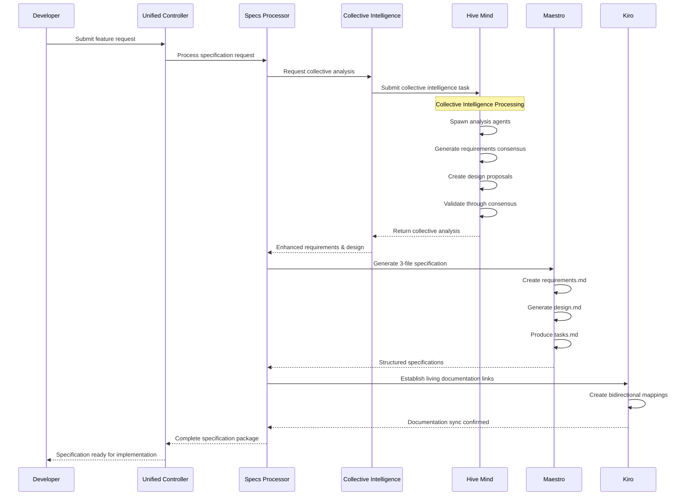
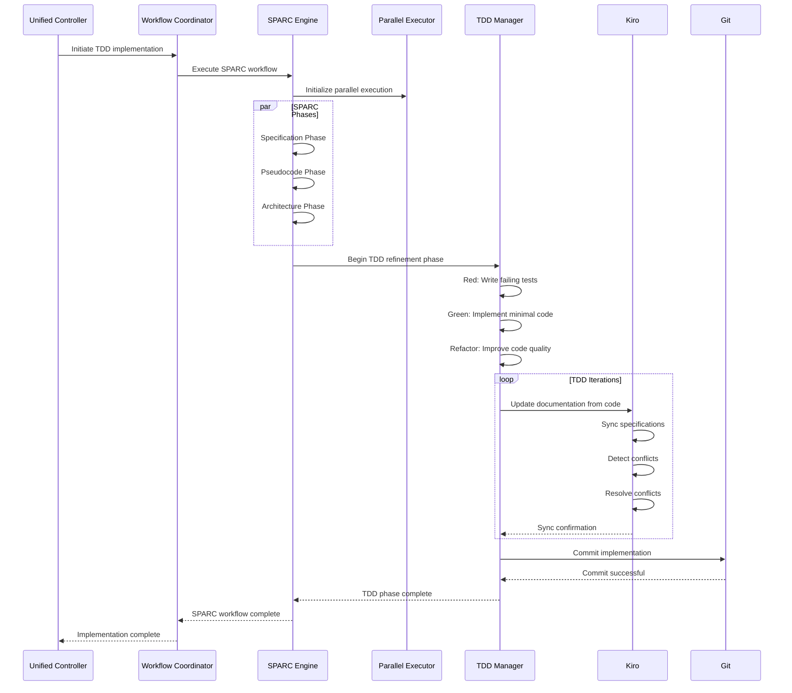
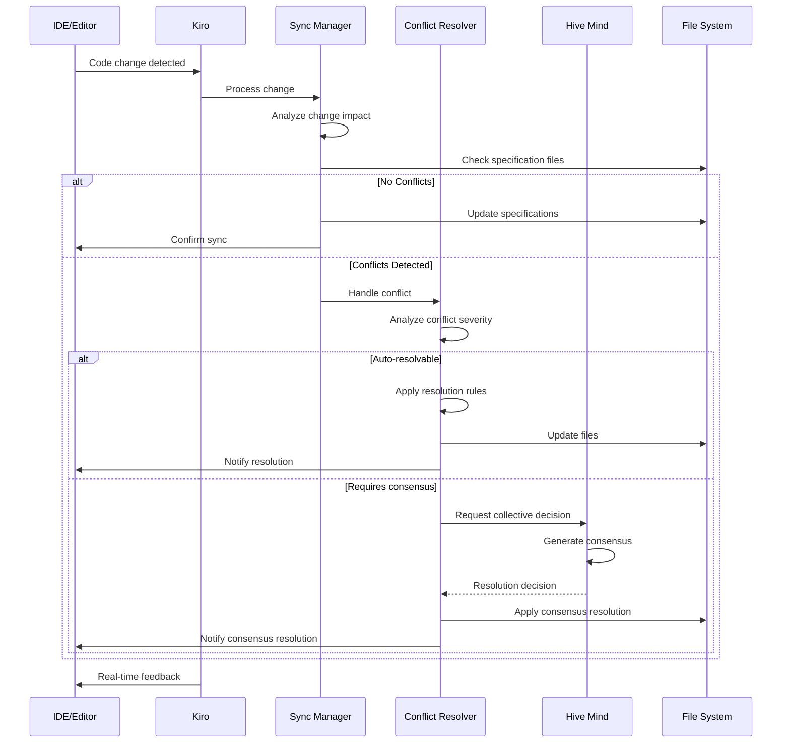
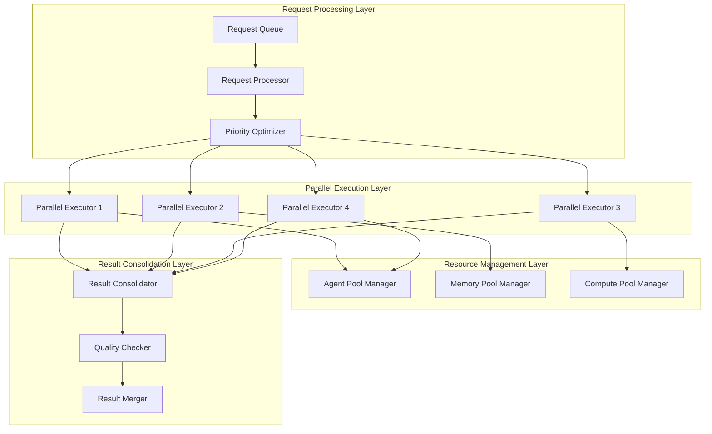
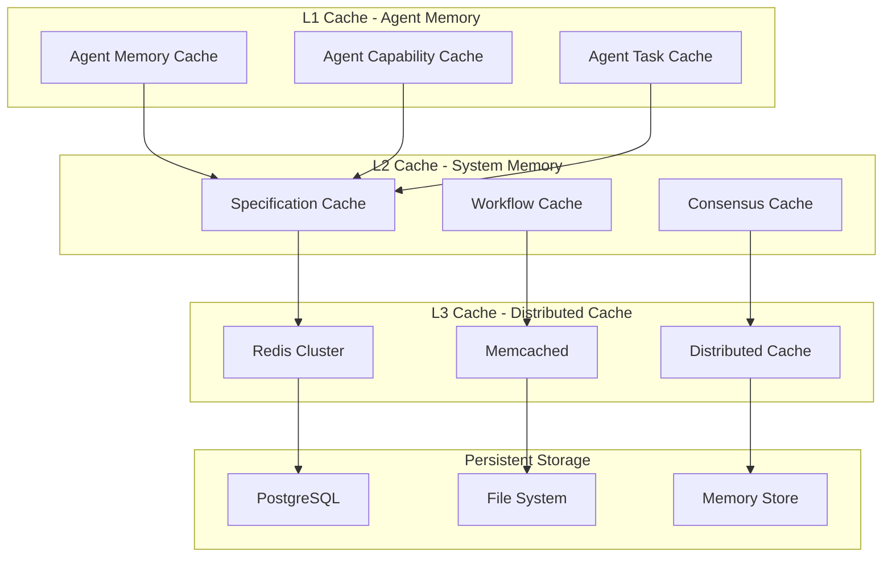

# Component Interaction Diagrams
## Unified Specs-Driven Flow Architecture - Detailed System Interactions

### System Overview Diagram



### Container-Level Architecture



### Component-Level Interactions

```mermaid
C4Component
    title Unified Controller - Component Diagram

    Component_Boundary(controller, "Unified Controller") {
        Component(flow_orchestrator, "Flow Orchestrator", "Main workflow coordination")
        Component(specs_processor, "Specs Processor", "Specification processing logic")
        Component(workflow_coordinator, "Workflow Coordinator", "Multi-system coordination")
        Component(collective_intelligence, "Collective Intelligence Manager", "Hive mind integration")
        Component(performance_optimizer, "Performance Optimizer", "Resource and performance management")
        Component(state_manager, "State Manager", "Workflow state management")
    }

    Component_Ext(hivemind, "HiveMind Core", "Collective intelligence")
    Component_Ext(maestro, "Maestro Orchestrator", "Specification management")
    Component_Ext(sparc, "SPARC Engine", "TDD workflows")
    Component_Ext(kiro, "Living Documentation", "Documentation sync")
    Component_Ext(event_bus, "Event Bus", "Event communication")
    Component_Ext(memory, "Memory System", "Data persistence")

    Rel(flow_orchestrator, specs_processor, "Process specifications")
    Rel(flow_orchestrator, workflow_coordinator, "Coordinate workflows")
    Rel(flow_orchestrator, state_manager, "Manage state")

    Rel(specs_processor, collective_intelligence, "Request analysis")
    Rel(workflow_coordinator, performance_optimizer, "Optimize resources")

    Rel(collective_intelligence, hivemind, "Submit collective tasks")
    Rel(specs_processor, maestro, "Generate specifications")
    Rel(workflow_coordinator, sparc, "Execute TDD workflows")
    Rel(specs_processor, kiro, "Sync documentation")

    Rel(flow_orchestrator, event_bus, "Publish events")
    Rel(state_manager, memory, "Persist state")
```

## Detailed Data Flow Diagrams

### Specification Generation Flow



### TDD Implementation Flow



### Real-Time Synchronization Flow



## API Specifications

### Unified Controller API

```typescript
/**
 * Unified Specs-Driven Flow Controller API
 * Central orchestration interface for all subsystems
 */
export interface UnifiedControllerAPI {
  // Core workflow operations
  createSpecification(request: SpecificationRequest): Promise<SpecificationResult>;
  executeWorkflow(workflowId: string, options?: WorkflowOptions): Promise<WorkflowResult>;
  getWorkflowStatus(workflowId: string): Promise<WorkflowStatus>;
  cancelWorkflow(workflowId: string): Promise<void>;

  // Collective intelligence operations
  requestCollectiveAnalysis(request: CollectiveAnalysisRequest): Promise<CollectiveAnalysisResult>;
  submitConsensusProposal(proposal: ConsensusProposal): Promise<ConsensusResult>;
  getConsensusStatus(proposalId: string): Promise<ConsensusStatus>;

  // Performance and monitoring
  getSystemMetrics(): Promise<UnifiedMetrics>;
  getPerformanceReport(timeframe?: string): Promise<PerformanceReport>;
  optimizeResources(): Promise<OptimizationResult>;

  // Configuration and management
  updateConfiguration(config: Partial<UnifiedFlowConfig>): Promise<void>;
  getConfiguration(): Promise<UnifiedFlowConfig>;
  healthCheck(): Promise<HealthStatus>;
}

export interface SpecificationRequest {
  featureName: string;
  description: string;
  requirements?: string[];
  constraints?: string[];
  priority: 'low' | 'medium' | 'high' | 'critical';
  enableCollectiveIntelligence?: boolean;
  enableLivingDocumentation?: boolean;
  sparcOptions?: SPARCOptions;
}

export interface SpecificationResult {
  workflowId: string;
  specifications: {
    requirements: string;
    design: string;
    tasks: string;
  };
  metadata: {
    generatedAt: Date;
    collectiveIntelligenceUsed: boolean;
    qualityScore: number;
    consensusAchieved?: boolean;
  };
}
```

### Hive Mind Integration API

```typescript
/**
 * Hive Mind Integration API
 * Interface for collective intelligence operations
 */
export interface HiveMindIntegrationAPI {
  // Collective intelligence
  submitCollectiveTask(task: CollectiveTask): Promise<CollectiveTaskResult>;
  getCollectiveTaskStatus(taskId: string): Promise<CollectiveTaskStatus>;
  getSwarmMetrics(swarmId?: string): Promise<SwarmMetrics>;

  // Consensus mechanisms
  createConsensusProposal(proposal: ConsensusProposal): Promise<string>;
  voteOnProposal(proposalId: string, vote: ConsensusVote): Promise<void>;
  getConsensusResult(proposalId: string): Promise<ConsensusResult>;

  // Agent management
  spawnAgents(agentSpecs: AgentSpawnOptions[]): Promise<string[]>;
  getAgentStatus(agentId: string): Promise<AgentStatus>;
  terminateAgent(agentId: string): Promise<void>;
}

export interface CollectiveTask {
  description: string;
  requiredCapabilities: string[];
  priority: TaskPriority;
  consensusRequired: boolean;
  timeoutMs?: number;
  metadata?: Record<string, unknown>;
}

export interface CollectiveTaskResult {
  taskId: string;
  result: unknown;
  agentsInvolved: string[];
  executionTime: number;
  qualityScore: number;
  consensusAchieved?: boolean;
}
```

### Maestro Integration API

```typescript
/**
 * Maestro Integration API
 * Interface for 3-file specification system
 */
export interface MaestroIntegrationAPI {
  // Specification management
  createSpecification(featureName: string, request: string): Promise<MaestroSpec>;
  generateDesign(specId: string): Promise<DesignDocument>;
  generateTasks(specId: string): Promise<TaskDocument>;
  implementTask(specId: string, taskId: number): Promise<TaskResult>;

  // Agent pool management
  getAgentPoolStats(): Promise<AgentPoolStats>;
  optimizeAgentPool(): Promise<OptimizationResult>;
  getAgentCapabilities(agentId: string): Promise<string[]>;

  // Workflow state
  getWorkflowState(featureName: string): Promise<MaestroWorkflowState>;
  approvePhase(featureName: string): Promise<void>;
  getPhaseHistory(featureName: string): Promise<PhaseHistory[]>;
}

export interface MaestroSpec {
  featureName: string;
  requirements: RequirementsDocument;
  design?: DesignDocument;
  tasks?: TaskDocument;
  metadata: SpecMetadata;
}

export interface AgentPoolStats {
  totalAgents: number;
  availableAgents: number;
  busyAgents: number;
  averageUsage: number;
  capabilitiesCovered: number;
  reuseRate: number;
}
```

### SPARC Integration API

```typescript
/**
 * SPARC Integration API
 * Interface for TDD methodology engine
 */
export interface SPARCIntegrationAPI {
  // SPARC workflow execution
  executeSpecificationPhase(input: SpecificationInput): Promise<SpecificationOutput>;
  executePseudocodePhase(spec: SpecificationOutput): Promise<PseudocodeOutput>;
  executeArchitecturePhase(pseudocode: PseudocodeOutput): Promise<ArchitectureOutput>;
  executeRefinementPhase(architecture: ArchitectureOutput): Promise<RefinementOutput>;
  executeCompletionPhase(refinement: RefinementOutput): Promise<CompletionOutput>;

  // Parallel execution
  enableParallelExecution(workflowId: string): Promise<void>;
  getParallelExecutionStatus(workflowId: string): Promise<ParallelExecutionStatus>;
  optimizeParallelExecution(workflowId: string): Promise<OptimizationResult>;

  // TDD management
  createTDDSession(sessionConfig: TDDSessionConfig): Promise<string>;
  executeTDDCycle(sessionId: string, cycle: TDDCycle): Promise<TDDCycleResult>;
  getTDDMetrics(sessionId: string): Promise<TDDMetrics>;
}

export interface SPARCOptions {
  enableParallelExecution: boolean;
  maxConcurrentPhases: number;
  tddIterationLimit: number;
  qualityThreshold: number;
  enableBatchOptimization: boolean;
}

export interface TDDCycle {
  red: TestDefinition[];
  green: ImplementationPlan;
  refactor: RefactoringPlan;
}
```

### Kiro IDE Integration API

```typescript
/**
 * Kiro IDE Integration API
 * Interface for living documentation system
 */
export interface KiroIntegrationAPI {
  // Living documentation
  enableLivingDocumentation(projectPath: string): Promise<void>;
  syncDocumentationFromCode(codeChanges: CodeChange[]): Promise<SyncResult>;
  syncCodeFromDocumentation(docChanges: DocumentationChange[]): Promise<SyncResult>;
  
  // Real-time synchronization
  startRealTimeSync(projectPath: string): Promise<void>;
  stopRealTimeSync(projectPath: string): Promise<void>;
  getRealTimeSyncStatus(projectPath: string): Promise<SyncStatus>;

  // Conflict resolution
  detectConflicts(projectPath: string): Promise<DocumentationConflict[]>;
  resolveConflict(conflictId: string, resolution: ConflictResolution): Promise<void>;
  getConflictResolutionOptions(conflictId: string): Promise<ConflictResolutionOption[]>;

  // Documentation quality
  assessDocumentationQuality(projectPath: string): Promise<QualityAssessment>;
  generateMissingDocumentation(projectPath: string): Promise<GeneratedDocumentation>;
  validateDocumentationConsistency(projectPath: string): Promise<ConsistencyReport>;
}

export interface SyncResult {
  success: boolean;
  filesChanged: string[];
  conflictsDetected: DocumentationConflict[];
  syncTime: number;
  qualityScore: number;
}

export interface DocumentationConflict {
  id: string;
  type: 'content' | 'structure' | 'semantic';
  severity: 'low' | 'medium' | 'high';
  description: string;
  affectedFiles: string[];
  resolutionOptions: ConflictResolutionOption[];
}
```

## Performance Optimization Patterns

### Concurrent Operations Pattern



### Cache Hierarchy Pattern



## Validation and Quality Assurance

### System Integrity Validation

```typescript
export class SystemIntegrityValidator {
  async validateUnifiedSystem(): Promise<ValidationReport> {
    const validations = await Promise.allSettled([
      this.validateHiveMindIntegration(),
      this.validateMaestroIntegration(),
      this.validateSPARCIntegration(),
      this.validateKiroIntegration(),
      this.validateDataFlowIntegrity(),
      this.validatePerformanceMetrics(),
      this.validateSecurityCompliance()
    ]);

    return this.generateValidationReport(validations);
  }

  private async validateHiveMindIntegration(): Promise<ValidationResult> {
    // Validate collective intelligence operations
    // Validate consensus mechanisms
    // Validate agent coordination
    // Validate swarm orchestration
  }

  private async validateMaestroIntegration(): Promise<ValidationResult> {
    // Validate 3-file specification generation
    // Validate agent pool management
    // Validate workflow state consistency
    // Validate specification quality
  }

  private async validateSPARCIntegration(): Promise<ValidationResult> {
    // Validate TDD workflow execution
    // Validate parallel execution efficiency
    // Validate test coverage and quality
    // Validate phase transitions
  }

  private async validateKiroIntegration(): Promise<ValidationResult> {
    // Validate living documentation sync
    // Validate conflict resolution mechanisms
    // Validate bidirectional synchronization
    // Validate documentation quality
  }
}
```

This comprehensive component interaction design provides the detailed blueprint for implementing the unified specs-driven flow architecture. The diagrams show clear separation of concerns, well-defined interfaces, and optimized data flows that maximize the benefits of each integrated system while maintaining overall system coherence and performance.