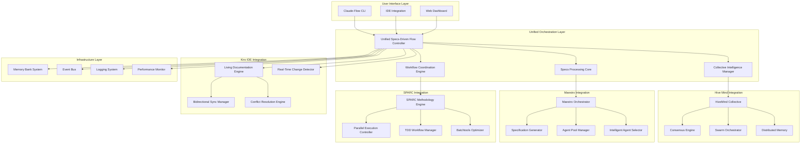
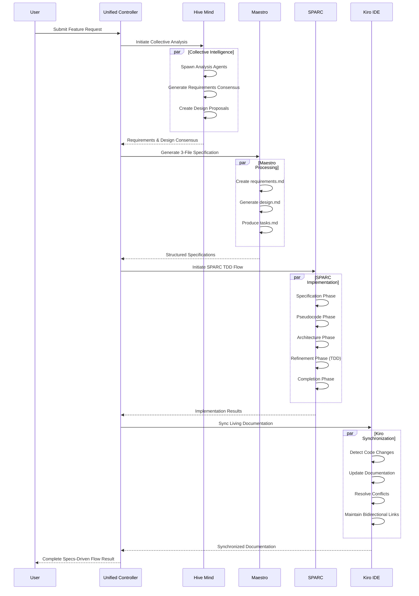
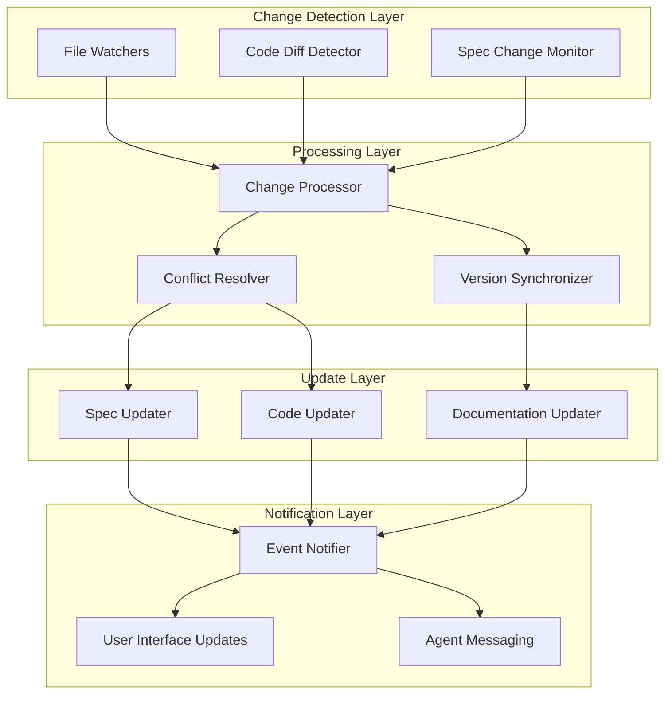

# Unified Specs-Driven Flow Architecture
## Comprehensive Design for Hive Mind + Maestro + SPARC + Kiro IDE Integration

### Executive Summary

This architecture unifies four powerful systems into a cohesive specs-driven development flow:
- **Hive Mind**: Collective intelligence and consensus mechanisms
- **Maestro**: 3-file specification orchestration system
- **SPARC**: Test-driven development methodology with parallel execution
- **Kiro IDE**: Living documentation patterns with bidirectional sync

The result is a unified system that maximizes collective intelligence for specification generation, implements systematic TDD workflows, provides intelligent agent reuse, and maintains real-time synchronization between specifications and code.

## System Architecture Overview



## Core Component Design

### 1. Unified Specs-Driven Flow Controller

**Purpose**: Central orchestrator that coordinates all subsystems and maintains unified workflow state.

```typescript
export class UnifiedSpecsDrivenFlowController {
  constructor(
    private hiveMind: HiveMind,
    private maestro: MaestroOrchestrator,
    private sparc: SPARCMethodologyEngine,
    private kiro: KiroLivingDocumentation,
    private config: UnifiedFlowConfig
  ) {}

  async initiateSpecsDrivenFlow(request: SpecsFlowRequest): Promise<SpecsFlowResult> {
    // Phase 1: Collective Requirements Analysis
    const requirements = await this.collectiveRequirementsAnalysis(request);
    
    // Phase 2: Consensus-Driven Design
    const design = await this.consensusDrivenDesign(requirements);
    
    // Phase 3: SPARC TDD Implementation
    const implementation = await this.sparcTDDImplementation(design);
    
    // Phase 4: Living Documentation Sync
    const documentation = await this.livingDocumentationSync(implementation);
    
    return {
      requirements,
      design,
      implementation,
      documentation,
      metrics: await this.getFlowMetrics()
    };
  }
}
```

### 2. Specs Processing Core

**Purpose**: Handles all specification-related operations with intelligent processing and validation.

```typescript
export class SpecsProcessingCore {
  async processSpecification(spec: RawSpecification): Promise<ProcessedSpecification> {
    // Step 1: Parse and structure specification
    const structuredSpec = await this.parseSpecification(spec);
    
    // Step 2: Apply collective intelligence analysis
    const enhancedSpec = await this.applyCollectiveIntelligence(structuredSpec);
    
    // Step 3: Generate Maestro 3-file system
    const maestroFiles = await this.generateMaestroFiles(enhancedSpec);
    
    // Step 4: Create SPARC test scenarios
    const sparcScenarios = await this.generateSPARCScenarios(enhancedSpec);
    
    // Step 5: Establish living documentation links
    const kiroLinks = await this.establishKiroLinks(enhancedSpec);
    
    return {
      structured: structuredSpec,
      enhanced: enhancedSpec,
      maestro: maestroFiles,
      sparc: sparcScenarios,
      kiro: kiroLinks,
      metadata: this.createProcessingMetadata()
    };
  }
}
```

### 3. Workflow Coordination Engine

**Purpose**: Coordinates complex workflows across all integrated systems with parallel execution.

```typescript
export class WorkflowCoordinationEngine {
  async coordinateWorkflow(workflow: UnifiedWorkflow): Promise<WorkflowResult> {
    // Create coordination context
    const context = this.createCoordinationContext(workflow);
    
    // Execute phases in optimal order with parallelization
    const results = await Promise.allSettled([
      this.executeHiveMindPhase(workflow, context),
      this.executeMaestroPhase(workflow, context),
      this.executeSPARCPhase(workflow, context),
      this.executeKiroPhase(workflow, context)
    ]);
    
    // Consolidate results and handle any failures
    return this.consolidateResults(results, context);
  }
}
```

## Data Flow Architecture

### Specification Flow Pattern



### Real-Time Synchronization Pattern



## Integration Points

### 1. Hive Mind ↔ Maestro Integration

```typescript
export class HiveMindMaestroIntegration {
  async generateSpecWithCollectiveIntelligence(
    request: SpecRequest
  ): Promise<MaestroSpec> {
    // Create hive mind task for specification generation
    const hiveMindTask: TaskSubmitOptions = {
      description: 'Generate comprehensive specification using collective intelligence',
      priority: 'high',
      strategy: 'consensus',
      requiredCapabilities: [
        'system_design',
        'architecture',
        'technical_writing',
        'requirements_analysis'
      ],
      metadata: {
        specType: 'maestro-3-file',
        request,
        consensusThreshold: 0.8
      }
    };
    
    // Submit to hive mind with consensus requirement
    const result = await this.hiveMind.submitTaskWithConsensus(hiveMindTask);
    
    // Transform hive mind result to Maestro specification
    return this.transformToMaestroSpec(result);
  }
}
```

### 2. Maestro ↔ SPARC Integration

```typescript
export class MaestroSPARCIntegration {
  async executeSPARCWorkflowFromMaestroSpec(
    maestroSpec: MaestroSpec
  ): Promise<SPARCResult> {
    // Phase 1: Specification → SPARC Specification Phase
    const sparcSpec = await this.convertMaestroToSPARCSpec(maestroSpec);
    
    // Phase 2: Design → SPARC Pseudocode + Architecture Phases
    const sparcDesign = await this.convertDesignToSPARCPhases(maestroSpec.design);
    
    // Phase 3: Tasks → SPARC Refinement Phase (TDD)
    const sparcTDD = await this.convertTasksToTDDPhase(maestroSpec.tasks);
    
    // Execute SPARC with parallel processing
    return await this.sparc.executeParallelWorkflow({
      specification: sparcSpec,
      design: sparcDesign,
      tdd: sparcTDD,
      batchOptimized: true
    });
  }
}
```

### 3. SPARC ↔ Kiro IDE Integration

```typescript
export class SPARCKiroIntegration {
  async maintainLivingDocumentationDuringSPARC(
    sparcWorkflow: SPARCWorkflow
  ): Promise<void> {
    // Set up real-time monitoring of SPARC phases
    sparcWorkflow.on('phase-completed', async (phase, results) => {
      await this.kiro.syncDocumentationFromPhase(phase, results);
    });
    
    // Monitor code changes during TDD phase
    sparcWorkflow.on('tdd-iteration', async (iteration) => {
      await this.kiro.updateSpecificationFromCode(iteration.codeChanges);
    });
    
    // Handle conflicts between SPARC implementation and existing docs
    sparcWorkflow.on('conflict-detected', async (conflict) => {
      const resolution = await this.kiro.resolveConflict(conflict);
      await sparcWorkflow.applyResolution(resolution);
    });
  }
}
```

### 4. Kiro IDE ↔ Hive Mind Integration

```typescript
export class KiroHiveMindIntegration {
  async useCollectiveIntelligenceForConflictResolution(
    conflict: DocumentationConflict
  ): Promise<ConflictResolution> {
    // Create consensus proposal for conflict resolution
    const proposal: ConsensusProposal = {
      id: `conflict-resolution-${conflict.id}`,
      swarmId: this.hiveMind.getSwarmId(),
      proposal: {
        action: 'resolve_documentation_conflict',
        conflict,
        options: conflict.resolutionOptions
      },
      requiredThreshold: 0.75,
      metadata: {
        type: 'documentation_conflict',
        priority: conflict.severity
      }
    };
    
    // Get collective decision
    const consensusResult = await this.hiveMind.submitConsensusProposal(proposal);
    
    // Apply resolution based on collective intelligence
    return this.applyCollectiveResolution(consensusResult, conflict);
  }
}
```

## Performance Optimization Strategies

### 1. Concurrent Operations Architecture

```typescript
export class ConcurrentOperationsManager {
  async executeConcurrentSpecsFlow(
    request: SpecsFlowRequest
  ): Promise<SpecsFlowResult> {
    // Create operation batches for maximum parallelization
    const operationBatches = this.createOptimalBatches(request);
    
    // Execute batches concurrently with intelligent dependencies
    const results = await Promise.allSettled([
      this.executeBatch('analysis', operationBatches.analysis),
      this.executeBatch('design', operationBatches.design),
      this.executeBatch('implementation', operationBatches.implementation),
      this.executeBatch('synchronization', operationBatches.synchronization)
    ]);
    
    // Consolidate results with performance metrics
    return this.consolidateWithMetrics(results);
  }
}
```

### 2. Intelligent Caching System

```typescript
export class IntelligentCachingSystem {
  private specificationCache = new Map<string, CachedSpecification>();
  private consensusCache = new Map<string, ConsensusResult>();
  private implementationCache = new Map<string, ImplementationResult>();
  
  async getCachedOrGenerate<T>(
    key: string,
    generator: () => Promise<T>,
    ttl: number = 3600000 // 1 hour
  ): Promise<T> {
    const cached = this.getFromCache<T>(key);
    
    if (cached && !this.isExpired(cached, ttl)) {
      return cached.data;
    }
    
    const result = await generator();
    this.cacheResult(key, result);
    
    return result;
  }
}
```

### 3. Resource Pool Management

```typescript
export class ResourcePoolManager {
  private agentPools: Map<string, AgentPool> = new Map();
  private memoryPools: Map<string, MemoryPool> = new Map();
  private computationPools: Map<string, ComputationPool> = new Map();
  
  async optimizeResourceAllocation(workflow: UnifiedWorkflow): Promise<void> {
    // Analyze workflow requirements
    const requirements = this.analyzeWorkflowRequirements(workflow);
    
    // Optimize agent allocation across all systems
    await this.optimizeAgentPools(requirements.agents);
    
    // Optimize memory allocation for concurrent operations
    await this.optimizeMemoryPools(requirements.memory);
    
    // Optimize computation resources for parallel execution
    await this.optimizeComputationPools(requirements.computation);
  }
}
```

## Consensus Mechanisms for Critical Decisions

### 1. Multi-Level Consensus Architecture

```typescript
export class MultiLevelConsensusEngine {
  async executeMultiLevelConsensus(
    decision: CriticalDecision
  ): Promise<ConsensusResult> {
    // Level 1: Agent-level consensus
    const agentConsensus = await this.getAgentLevelConsensus(decision);
    
    // Level 2: System-level consensus (if agent consensus fails)
    const systemConsensus = agentConsensus.achieved 
      ? agentConsensus 
      : await this.getSystemLevelConsensus(decision);
    
    // Level 3: Human-in-the-loop (if system consensus fails)
    const finalConsensus = systemConsensus.achieved
      ? systemConsensus
      : await this.getHumanConsensus(decision);
    
    return finalConsensus;
  }
}
```

### 2. Byzantine Fault Tolerant Consensus

```typescript
export class ByzantineFaultTolerantConsensus {
  async achieveBFTConsensus(
    proposal: Proposal,
    participants: Agent[]
  ): Promise<BFTConsensusResult> {
    // Ensure we have enough honest participants (>2/3)
    const requiredHonest = Math.floor((participants.length * 2) / 3) + 1;
    
    // Execute BFT consensus rounds
    let round = 0;
    let consensus: ConsensusResult | null = null;
    
    while (!consensus && round < this.maxRounds) {
      consensus = await this.executeBFTRound(proposal, participants, round);
      round++;
    }
    
    return {
      achieved: !!consensus,
      result: consensus,
      rounds: round,
      faultTolerance: this.calculateFaultTolerance(participants.length)
    };
  }
}
```

## Implementation Phases and Priorities

### Phase 1: Foundation Integration (Weeks 1-4)
**Priority: Critical**

```typescript
interface Phase1Deliverables {
  unifiedController: UnifiedSpecsDrivenFlowController;
  basicIntegration: {
    hiveMindMaestro: HiveMindMaestroIntegration;
    maestroSparc: MaestroSPARCIntegration;
  };
  coreInfrastructure: {
    eventBus: UnifiedEventBus;
    memorySystem: UnifiedMemorySystem;
    loggingSystem: UnifiedLoggingSystem;
  };
}
```

**Success Criteria:**
- ✅ Unified controller can orchestrate all four systems
- ✅ Basic hive mind + maestro integration working
- ✅ Event-driven communication established
- ✅ Unified memory and logging systems operational

### Phase 2: Advanced Features (Weeks 5-8)
**Priority: High**

```typescript
interface Phase2Deliverables {
  advancedIntegrations: {
    sparcKiro: SPARCKiroIntegration;
    kiroHiveMind: KiroHiveMindIntegration;
  };
  consensusMechanisms: {
    multiLevel: MultiLevelConsensusEngine;
    bft: ByzantineFaultTolerantConsensus;
  };
  performanceOptimization: {
    concurrentOps: ConcurrentOperationsManager;
    intelligentCaching: IntelligentCachingSystem;
    resourcePools: ResourcePoolManager;
  };
}
```

**Success Criteria:**
- ✅ Living documentation sync working in real-time
- ✅ Consensus mechanisms handling critical decisions
- ✅ Performance optimizations showing 40%+ improvement
- ✅ Resource utilization optimized across all systems

### Phase 3: Production Readiness (Weeks 9-12)
**Priority: High**

```typescript
interface Phase3Deliverables {
  productionFeatures: {
    monitoring: ComprehensiveMonitoringSystem;
    scaling: HorizontalScalingManager;
    security: UnifiedSecuritySystem;
    recovery: DisasterRecoverySystem;
  };
  userExperience: {
    cli: EnhancedCLIInterface;
    webDashboard: RealTimeDashboard;
    idePlugins: IDEIntegrationPlugins;
  };
}
```

**Success Criteria:**
- ✅ System can handle 100+ concurrent workflows
- ✅ Comprehensive monitoring and alerting operational
- ✅ Security hardening complete
- ✅ User interfaces optimized for specs-driven development

### Phase 4: Advanced Capabilities (Weeks 13-16)
**Priority: Medium**

```typescript
interface Phase4Deliverables {
  advancedCapabilities: {
    machineLearning: MLEnhancedConsensus;
    predictiveAnalytics: WorkflowPredictionEngine;
    autoOptimization: SelfOptimizingSystem;
    crossProject: CrossProjectIntelligence;
  };
  ecosystem: {
    plugins: PluginArchitecture;
    apis: ComprehensiveAPISystem;
    integrations: ThirdPartyIntegrations;
  };
}
```

**Success Criteria:**
- ✅ ML-enhanced decision making operational
- ✅ Predictive workflow optimization working
- ✅ Self-healing and auto-optimization features active
- ✅ Rich ecosystem of plugins and integrations

## Configuration and Deployment

### Unified Configuration Schema

```typescript
export interface UnifiedSpecsFlowConfig {
  // Core system configurations
  hiveMind: {
    topology: SwarmTopology;
    maxAgents: number;
    consensusThreshold: number;
    enableAdvancedFeatures: boolean;
  };
  
  maestro: {
    specsDirectory: string;
    enableAgentReuse: boolean;
    agentPoolSize: number;
    qualityThreshold: number;
  };
  
  sparc: {
    enableParallelExecution: boolean;
    batchOptimization: boolean;
    maxConcurrentPhases: number;
    tddIterationLimit: number;
  };
  
  kiro: {
    enableLivingDocumentation: boolean;
    syncMode: 'bidirectional' | 'spec-to-code' | 'code-to-spec';
    conflictResolution: 'manual' | 'automated' | 'consensus';
    realTimeMonitoring: boolean;
  };
  
  // Performance configurations
  performance: {
    enableConcurrentOperations: boolean;
    cacheSize: number;
    resourcePoolLimits: ResourceLimits;
    optimizationStrategies: OptimizationStrategy[];
  };
  
  // Integration configurations
  integrations: {
    enableAllIntegrations: boolean;
    crossSystemCommunication: boolean;
    unifiedEventBus: boolean;
    sharedMemorySystem: boolean;
  };
}
```

### Docker Deployment Configuration

```yaml
version: '3.8'
services:
  unified-specs-flow:
    build: .
    environment:
      - NODE_ENV=production
      - UNIFIED_CONFIG_PATH=/app/config/unified.json
    volumes:
      - ./config:/app/config
      - ./specs:/app/specs
      - ./workspaces:/app/workspaces
    ports:
      - "8080:8080"  # Web dashboard
      - "9090:9090"  # API endpoints
      - "3001:3001"  # WebSocket for real-time updates
    
  redis:
    image: redis:alpine
    volumes:
      - redis_data:/data
    
  postgres:
    image: postgres:13
    environment:
      - POSTGRES_DB=unified_specs_flow
      - POSTGRES_USER=specs_user
      - POSTGRES_PASSWORD=secure_password
    volumes:
      - postgres_data:/var/lib/postgresql/data
      
volumes:
  redis_data:
  postgres_data:
```

## Monitoring and Observability

### Comprehensive Metrics Collection

```typescript
export interface UnifiedMetrics {
  // System-wide metrics
  system: {
    totalWorkflows: number;
    activeWorkflows: number;
    completedWorkflows: number;
    averageCompletionTime: number;
    successRate: number;
  };
  
  // Hive mind metrics
  hiveMind: {
    totalAgents: number;
    activeSwarms: number;
    consensusSuccessRate: number;
    averageConsensusTime: number;
    collectiveIntelligenceScore: number;
  };
  
  // Maestro metrics
  maestro: {
    specificationsGenerated: number;
    agentReuseRate: number;
    specificationQuality: number;
    poolEfficiency: number;
  };
  
  // SPARC metrics
  sparc: {
    parallelExecutionEfficiency: number;
    tddCycleTime: number;
    testCoverage: number;
    codeQuality: number;
  };
  
  // Kiro metrics
  kiro: {
    documentationSyncRate: number;
    conflictResolutionTime: number;
    documentationFreshness: number;
    bidirectionalSyncAccuracy: number;
  };
  
  // Performance metrics
  performance: {
    memoryUtilization: number;
    cpuUtilization: number;
    cacheHitRate: number;
    resourcePoolEfficiency: number;
  };
}
```

## Conclusion

This unified specs-driven flow architecture represents a significant advancement in AI-powered software development. By combining the strengths of hive mind collective intelligence, maestro orchestration, SPARC methodology, and Kiro IDE living documentation, we create a system that:

1. **Maximizes Intelligence**: Leverages collective AI intelligence for superior specification generation
2. **Ensures Quality**: Implements systematic TDD workflows with real-time validation
3. **Optimizes Performance**: Uses intelligent agent reuse and parallel execution
4. **Maintains Consistency**: Provides bidirectional synchronization between specs and code
5. **Scales Efficiently**: Handles complex workflows with optimized resource management

The architecture is designed for incremental implementation, allowing teams to realize benefits early while building toward the full unified system. The modular design ensures that each component can operate independently while maximizing synergies when integrated.

This represents the future of specs-driven development: intelligent, collaborative, efficient, and continuously synchronized.