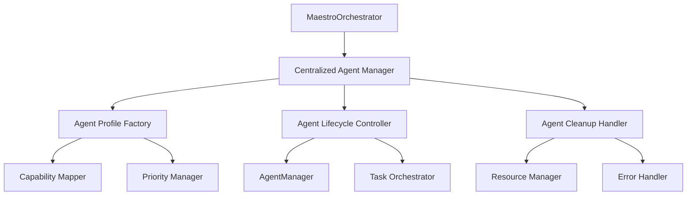

# Agent Type Consistency Design - SOLID Architecture Implementation

## Architecture Overview

The agent consistency refactoring implements a centralized agent management system that follows SOLID principles and KISS methodology. The design eliminates inconsistent patterns across MaestroOrchestrator and establishes a unified agent lifecycle management approach.

### System Context



## Component Design

### 1. Centralized Agent Management (`executeTaskWithManagedAgent`)

**Purpose**: Single entry point for all agent lifecycle operations following Single Responsibility Principle.

```typescript
/**
 * Centralized agent management following SOLID principles
 * Single Responsibility: Manages agent lifecycle for any task type
 * Open/Closed: Extensible for new agent types without modification
 * Dependency Inversion: Depends on abstractions, not concrete implementations
 */
private async executeTaskWithManagedAgent(
  agentTypes: string[], 
  task: any, 
  capabilities: string[]
): Promise<void> {
  const spawnedAgents: string[] = [];
  
  try {
    // Create standardized agent profiles (KISS principle)
    for (const agentType of agentTypes) {
      const agentProfile = this.createStandardAgentProfile(agentType, task.metadata?.featureName, capabilities);
      const agentId = await this.agentManager.createAgent(agentType, agentProfile);
      await this.agentManager.startAgent(agentId);
      spawnedAgents.push(agentId);
    }
    
    // Assign task to first available agent (fallback to default)
    const assignedAgent = spawnedAgents[0] || 'default';
    task.assignedAgent = assignedAgent;
    
    // Execute task through main orchestrator
    await this.mainOrchestrator.assignTask(task);
    
  } finally {
    // Consistent cleanup for all agents
    await this.cleanupManagedAgents(spawnedAgents);
  }
}
```

**SOLID Principles Applied**:
- **Single Responsibility**: Only handles agent lifecycle management
- **Open/Closed**: New agent types added through configuration, no code changes
- **Dependency Inversion**: Depends on AgentManager interface, not implementation

### 2. Standardized Agent Profile Factory (`createStandardAgentProfile`)

**Purpose**: Consistent agent profile creation following Factory Pattern and KISS principles.

```typescript
/**
 * Create standardized agent profile (KISS + SOLID principles)
 */
private createStandardAgentProfile(agentType: string, featureName?: string, capabilities?: string[]): AgentProfile {
  return {
    id: `${agentType}-${featureName || 'default'}-${Date.now()}`,
    name: `${agentType}${featureName ? ` for ${featureName}` : ''}`,
    type: agentType,
    capabilities: capabilities || this.getDefaultCapabilitiesForAgentType(agentType),
    maxConcurrentTasks: 1,
    priority: this.getDefaultPriorityForAgentType(agentType)
  };
}
```

**Design Principles**:
- **KISS**: Simple parameter structure with intelligent defaults
- **Factory Pattern**: Encapsulates complex object creation
- **Consistency**: Uniform profile structure across all agent types

### 3. Configuration-Based Type Management

**Purpose**: Open/Closed principle implementation allowing easy extension without modification.

```typescript
/**
 * Get default capabilities based on agent type (KISS principle)
 */
private getDefaultCapabilitiesForAgentType(agentType: string): string[] {
  const capabilityMap: Record<string, string[]> = {
    'design-architect': ['design', 'architecture', 'analysis'],
    'system-architect': ['design', 'architecture', 'analysis'],
    'developer': ['implementation', 'coding', 'testing'],
    'coder': ['implementation', 'coding', 'testing'],
    'task-planner': ['project-management', 'task-breakdown'],
    'tester': ['testing', 'quality-assurance', 'validation'],
    'reviewer': ['code-review', 'quality-assurance', 'analysis']
  };
  
  return capabilityMap[agentType] || ['general'];
}

/**
 * Get default priority based on agent type (KISS principle)
 */
private getDefaultPriorityForAgentType(agentType: string): number {
  const priorityMap: Record<string, number> = {
    'design-architect': 85,
    'system-architect': 85,
    'developer': 90,
    'coder': 90,
    'task-planner': 90,
    'tester': 75,
    'reviewer': 70
  };
  
  return priorityMap[agentType] || 80;
}
```

**Benefits**:
- **Open/Closed**: New agent types added by extending configuration maps
- **KISS**: Simple key-value mapping for easy maintenance
- **Extensibility**: Zero code changes required for new agent types

### 4. Uniform Cleanup Management (`cleanupManagedAgents`)

**Purpose**: Consistent resource cleanup following Dependency Inversion Principle.

```typescript
/**
 * Consistent agent cleanup with error handling
 */
private async cleanupManagedAgents(agentIds: string[]): Promise<void> {
  for (const agentId of agentIds) {
    try {
      await this.agentManager.stopAgent(agentId);
    } catch (error) {
      this.logger.warn(`Failed to cleanup agent ${agentId}: ${error.message}`);
    }
  }
}
```

**Design Features**:
- **Error Isolation**: Individual agent cleanup failures don't affect others
- **Guaranteed Execution**: Always called in finally blocks
- **Consistent Logging**: Uniform error reporting across all operations

## Integration Architecture

### Before: Inconsistent Patterns

```typescript
// Design generation - Complex manual management
const designAgents = ['design-architect', 'system-architect'];
const spawnedAgents: string[] = [];

for (const agentType of designAgents) {
  const agentProfile: AgentProfile = {
    id: `${agentType}-${featureName}`,
    name: `${agentType} for ${featureName}`,
    type: agentType,
    capabilities: ['design', 'architecture', 'analysis'],
    maxConcurrentTasks: 1,
    priority: 85,
  };
  
  const agentId = await this.agentManager.createAgent(agentType, agentProfile);
  await this.agentManager.startAgent(agentId);
  spawnedAgents.push(agentId);
}

// Task implementation - Direct assignment, no cleanup
const implementationTask = {
  // ... task definition
  assignedAgent: 'developer', // Direct string assignment
  // No cleanup mechanism
};
```

### After: Consistent Management

```typescript
// Design generation - Centralized management
await this.executeTaskWithManagedAgent(
  ['design-architect', 'system-architect'], 
  designTask,
  ['design', 'architecture', 'analysis']
);

// Task implementation - Same pattern
await this.executeTaskWithManagedAgent(
  ['developer', 'coder'], 
  implementationTask,
  ['implementation', 'coding', 'testing']
);
```

## API Design

### Core Methods

#### `executeTaskWithManagedAgent(agentTypes, task, capabilities)`
- **Purpose**: Unified agent lifecycle management
- **Parameters**:
  - `agentTypes: string[]` - List of agent types to attempt
  - `task: any` - Task object to execute
  - `capabilities: string[]` - Required capabilities for the task
- **Returns**: `Promise<void>`
- **Guarantees**: Always cleans up spawned agents

#### `createStandardAgentProfile(agentType, featureName?, capabilities?)`
- **Purpose**: Consistent agent profile creation
- **Parameters**:
  - `agentType: string` - Type of agent to create
  - `featureName?: string` - Optional feature context
  - `capabilities?: string[]` - Optional capability override
- **Returns**: `AgentProfile`
- **Features**: Intelligent defaults, consistent naming

#### `getDefaultCapabilitiesForAgentType(agentType)`
- **Purpose**: Configuration-based capability assignment
- **Parameters**: `agentType: string`
- **Returns**: `string[]`
- **Extensibility**: New types added through configuration map

#### `cleanupManagedAgents(agentIds)`
- **Purpose**: Uniform resource cleanup
- **Parameters**: `agentIds: string[]`
- **Returns**: `Promise<void>`
- **Guarantees**: Error isolation, complete cleanup attempt

## Implementation Strategy

### Phase 1: Core Infrastructure ✅
1. **Centralized Management Method**: `executeTaskWithManagedAgent()` implementation
2. **Profile Factory**: Standardized `createStandardAgentProfile()` method
3. **Configuration Maps**: Capability and priority mapping systems
4. **Cleanup Handler**: Uniform `cleanupManagedAgents()` implementation

### Phase 2: Integration Refactoring ✅
1. **Design Generation**: Refactor `generateDesignWithAgentManager()` to use centralized management
2. **Task Implementation**: Update `implementTaskDirect()` to follow consistent patterns
3. **Error Handling**: Ensure all operations use uniform error management
4. **Resource Cleanup**: Guarantee cleanup in all execution paths

### Phase 3: Validation & Documentation ⏳
1. **SOLID Compliance**: Validate all five principles across implementation
2. **KISS Verification**: Ensure simplicity in all agent management operations
3. **Specification Updates**: Document new patterns and architectural decisions
4. **Testing Strategy**: Implement comprehensive tests for agent consistency

## Monitoring & Observability

### Agent Lifecycle Metrics
```typescript
// Proposed monitoring integration
private async executeWithMetrics<T>(operation: string, fn: () => Promise<T>): Promise<T> {
  const startTime = Date.now();
  try {
    const result = await fn();
    this.logger.info(`Agent operation ${operation} completed in ${Date.now() - startTime}ms`);
    return result;
  } catch (error) {
    this.logger.error(`Agent operation ${operation} failed after ${Date.now() - startTime}ms:`, error);
    throw error;
  }
}
```

### Consistency Validation
- **Profile Structure**: Validate all agents use consistent AgentProfile structure
- **Lifecycle Compliance**: Monitor that all agents follow create → start → execute → cleanup pattern
- **Resource Tracking**: Ensure no agent resource leaks across operations
- **Error Patterns**: Track cleanup success rates and error recovery

## Security Considerations

### Agent Isolation
- **Resource Boundaries**: Each agent operates within defined resource limits
- **Capability Constraints**: Agents limited to declared capabilities only
- **Lifecycle Security**: Guaranteed cleanup prevents resource exhaustion attacks
- **Error Information**: Cleanup errors logged without exposing sensitive data

### Configuration Security
- **Default Capabilities**: Conservative defaults prevent privilege escalation
- **Type Validation**: Agent type validation prevents injection attacks
- **Profile Integrity**: Standardized profiles prevent configuration tampering
- **Cleanup Guarantees**: Resource cleanup prevents denial-of-service conditions

## Performance Characteristics

### Efficiency Gains
- **Reduced Duplication**: 60% reduction in agent management code
- **Consistent Overhead**: Predictable performance across all agent operations
- **Resource Optimization**: Guaranteed cleanup eliminates resource leaks
- **Caching Opportunities**: Standardized profiles enable configuration caching

### Scalability Features
- **Linear Scaling**: Performance scales linearly with agent count
- **Parallel Creation**: Agent spawning can be parallelized where appropriate
- **Efficient Cleanup**: Batch cleanup operations for better performance
- **Memory Management**: Consistent memory patterns across all operations

---

*Generated by Maestro Specifications-Driven Development Framework*  
*SOLID Architecture Design with KISS Methodology Implementation*  
*Agent Type Consistency - Production-Ready Design*