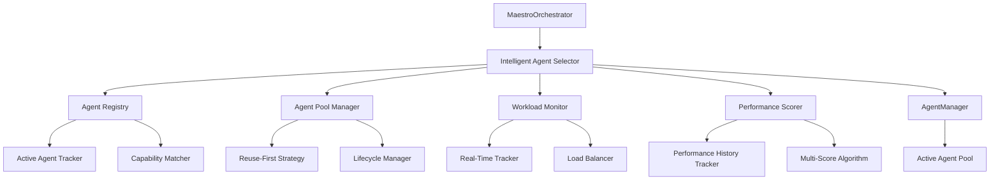
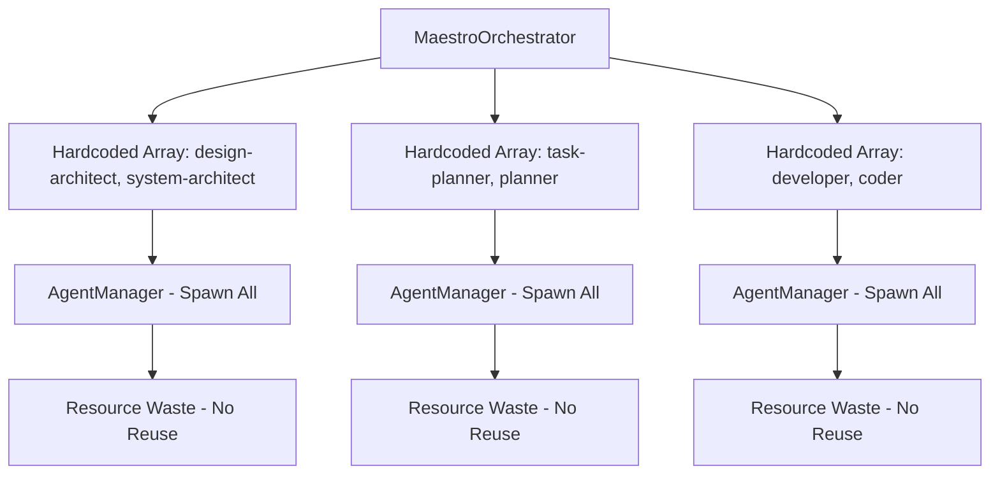
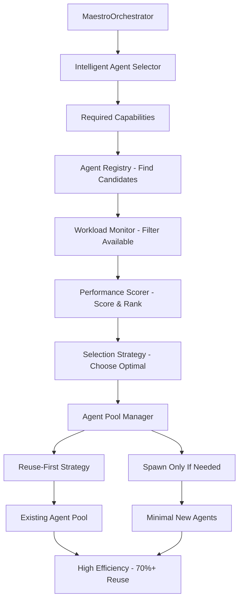

# Agent Reuse Optimization Design - Intelligent Selection Architecture

## Architecture Overview

The agent reuse optimization implements an intelligent, capability-based agent selection system that replaces hardcoded agent type arrays with dynamic, workload-aware assignment. The system maximizes agent reuse through active pool management, real-time performance tracking, and multi-criteria optimization following SOLID principles.

### System Context



## Component Design

### 1. Intelligent Agent Selector (Core Controller)

**Purpose**: Central orchestrator for all agent selection decisions, implementing strategy pattern for different optimization approaches.

```typescript
/**
 * Intelligent Agent Selector - Core component implementing capability-based selection
 * Follows SOLID principles with strategy pattern for different optimization goals
 */
export class IntelligentAgentSelector {
  constructor(
    private agentRegistry: AgentRegistry,
    private poolManager: AgentPoolManager,
    private workloadMonitor: WorkloadMonitor,
    private performanceScorer: PerformanceScorer,
    private selectionStrategy: SelectionStrategy = new BalancedSelectionStrategy()
  ) {}

  /**
   * Primary selection method - replaces hardcoded agent arrays
   * @param requiredCapabilities - Required capabilities for the task
   * @param taskContext - Context about the task being executed
   * @param options - Selection options and constraints
   * @returns Optimal agent selection based on multiple criteria
   */
  async selectOptimalAgents(
    requiredCapabilities: string[],
    taskContext: TaskContext,
    options: SelectionOptions = {}
  ): Promise<AgentSelection> {
    // 1. Find candidates with matching capabilities
    const candidates = await this.agentRegistry.findCapableAgents(requiredCapabilities);
    
    // 2. Apply workload filtering
    const availableCandidates = await this.workloadMonitor.filterByAvailability(candidates);
    
    // 3. Score candidates using multi-criteria algorithm
    const scoredCandidates = await this.performanceScorer.scoreAgents(
      availableCandidates,
      requiredCapabilities,
      taskContext
    );
    
    // 4. Apply selection strategy
    return this.selectionStrategy.selectAgents(scoredCandidates, options);
  }

  /**
   * Enhanced task execution with intelligent agent reuse
   * Replaces executeTaskWithManagedAgent with intelligent selection
   */
  async executeTaskWithIntelligentSelection(
    requiredCapabilities: string[],
    task: TaskDefinition,
    options: ExecutionOptions = {}
  ): Promise<TaskResult> {
    // Intelligent selection with reuse prioritization
    const selection = await this.selectOptimalAgents(requiredCapabilities, task, {
      preferReuse: true,
      maxAgents: options.maxAgents || 2,
      priorityThreshold: options.priorityThreshold || 0.8
    });
    
    return this.executeWithSelectedAgents(selection, task);
  }
}
```

### 2. Agent Registry (State Management)

**Purpose**: Maintains comprehensive registry of all active agents with real-time capability and status tracking.

```typescript
/**
 * Agent Registry - Centralized tracking of all agents and their capabilities
 * Implements Single Responsibility principle for agent state management
 */
export class AgentRegistry {
  private activeAgents: Map<string, RegisteredAgent> = new Map();
  private capabilityIndex: Map<string, Set<string>> = new Map();
  private statusSubscribers: Set<AgentStatusSubscriber> = new Set();

  /**
   * Register new agent with comprehensive metadata
   */
  async registerAgent(agentId: string, profile: AgentProfile): Promise<void> {
    const registeredAgent: RegisteredAgent = {
      id: agentId,
      profile,
      status: 'available',
      currentWorkload: 0,
      capabilities: profile.capabilities || [],
      performanceHistory: new PerformanceHistory(),
      registeredAt: new Date(),
      lastActivity: new Date()
    };

    this.activeAgents.set(agentId, registeredAgent);
    this.updateCapabilityIndex(agentId, registeredAgent.capabilities);
    this.notifyStatusChange(agentId, 'registered');
  }

  /**
   * Find agents with matching capabilities using efficient indexing
   */
  async findCapableAgents(requiredCapabilities: string[]): Promise<RegisteredAgent[]> {
    const candidateIds = new Set<string>();
    
    // Use capability index for efficient lookup
    for (const capability of requiredCapabilities) {
      const agentsWithCapability = this.capabilityIndex.get(capability) || new Set();
      if (candidateIds.size === 0) {
        agentsWithCapability.forEach(id => candidateIds.add(id));
      } else {
        // Intersection - agents must have ALL required capabilities
        const intersection = new Set<string>();
        candidateIds.forEach(id => {
          if (agentsWithCapability.has(id)) {
            intersection.add(id);
          }
        });
        candidateIds.clear();
        intersection.forEach(id => candidateIds.add(id));
      }
    }

    return Array.from(candidateIds).map(id => this.activeAgents.get(id)!).filter(Boolean);
  }

  /**
   * Update agent status with event notification
   */
  async updateAgentStatus(agentId: string, status: AgentStatus, metadata?: any): Promise<void> {
    const agent = this.activeAgents.get(agentId);
    if (agent) {
      agent.status = status;
      agent.lastActivity = new Date();
      if (metadata) {
        agent.metadata = { ...agent.metadata, ...metadata };
      }
      this.notifyStatusChange(agentId, status);
    }
  }

  /**
   * Get comprehensive agent statistics
   */
  getRegistryStats(): RegistryStatistics {
    const agents = Array.from(this.activeAgents.values());
    return {
      totalAgents: agents.length,
      availableAgents: agents.filter(a => a.status === 'available').length,
      busyAgents: agents.filter(a => a.status === 'busy').length,
      averageWorkload: agents.reduce((sum, a) => sum + a.currentWorkload, 0) / agents.length,
      capabilityCoverage: this.capabilityIndex.size,
      registryHealth: this.calculateRegistryHealth()
    };
  }
}
```

### 3. Agent Pool Manager (Resource Optimization)

**Purpose**: Implements reuse-first strategy with intelligent pool sizing and lifecycle management.

```typescript
/**
 * Agent Pool Manager - Optimizes agent lifecycle and reuse patterns
 * Implements Open/Closed principle for extensible pool strategies
 */
export class AgentPoolManager {
  private reuseStrategy: ReuseStrategy;
  private lifecycleManager: AgentLifecycleManager;
  private poolOptimizer: PoolOptimizer;

  constructor(
    private agentManager: AgentManager,
    private registry: AgentRegistry,
    config: PoolManagerConfig
  ) {
    this.reuseStrategy = new GreedyReuseStrategy(config);
    this.lifecycleManager = new AgentLifecycleManager(config);
    this.poolOptimizer = new DynamicPoolOptimizer(config);
  }

  /**
   * Primary agent acquisition method - reuse first, spawn if needed
   */
  async acquireAgents(
    requiredCapabilities: string[],
    taskContext: TaskContext,
    maxAgents: number = 2
  ): Promise<AcquiredAgent[]> {
    // Step 1: Try to reuse existing agents
    const reusableAgents = await this.reuseStrategy.findReusableAgents(
      requiredCapabilities,
      taskContext,
      maxAgents
    );

    // Step 2: Spawn additional agents if needed
    const needed = maxAgents - reusableAgents.length;
    const newAgents = needed > 0 
      ? await this.spawnOptimalAgents(requiredCapabilities, taskContext, needed)
      : [];

    // Step 3: Mark agents as in-use and track assignment
    const allAgents = [...reusableAgents, ...newAgents];
    await this.assignAgentsToTask(allAgents, taskContext);

    return allAgents;
  }

  /**
   * Intelligent agent spawning when reuse is not possible
   */
  private async spawnOptimalAgents(
    requiredCapabilities: string[],
    taskContext: TaskContext,
    count: number
  ): Promise<AcquiredAgent[]> {
    const spawnedAgents: AcquiredAgent[] = [];
    
    // Use pool optimizer to determine optimal agent types
    const optimalTypes = await this.poolOptimizer.selectOptimalTypesForSpawning(
      requiredCapabilities,
      taskContext,
      count
    );

    for (const agentType of optimalTypes) {
      try {
        const profile = this.createOptimalProfile(agentType, requiredCapabilities, taskContext);
        const agentId = await this.agentManager.createAgent(agentType, profile);
        await this.agentManager.startAgent(agentId);
        
        const acquiredAgent: AcquiredAgent = {
          id: agentId,
          type: agentType,
          capabilities: profile.capabilities || [],
          source: 'spawned',
          spawnedAt: new Date()
        };

        spawnedAgents.push(acquiredAgent);
        await this.registry.registerAgent(agentId, profile);
        
      } catch (error) {
        this.logger.warn(`Failed to spawn ${agentType}: ${error.message}`);
      }
    }

    return spawnedAgents;
  }

  /**
   * Release agents back to pool with intelligent cleanup decisions
   */
  async releaseAgents(agentIds: string[], taskContext: TaskContext): Promise<void> {
    for (const agentId of agentIds) {
      try {
        // Update agent status
        await this.registry.updateAgentStatus(agentId, 'available');
        
        // Decide whether to keep or cleanup based on pool optimization
        const shouldCleanup = await this.poolOptimizer.shouldCleanupAgent(agentId, taskContext);
        
        if (shouldCleanup) {
          await this.lifecycleManager.cleanupAgent(agentId);
        } else {
          // Keep agent in pool for reuse
          await this.lifecycleManager.maintainAgent(agentId);
        }
      } catch (error) {
        this.logger.warn(`Failed to release agent ${agentId}: ${error.message}`);
      }
    }
  }

  /**
   * Pool health monitoring and optimization
   */
  async optimizePool(): Promise<PoolOptimizationResult> {
    const stats = this.registry.getRegistryStats();
    
    // Identify optimization opportunities
    const recommendations = await this.poolOptimizer.analyzePoolHealth(stats);
    
    // Apply optimizations
    const results = await this.poolOptimizer.applyOptimizations(recommendations);
    
    return {
      initialStats: stats,
      recommendations,
      results,
      optimizedAt: new Date()
    };
  }
}
```

### 4. Workload Monitor (Real-Time Tracking)

**Purpose**: Real-time monitoring of agent workloads and availability for intelligent load balancing.

```typescript
/**
 * Workload Monitor - Real-time agent workload tracking and load balancing
 * Implements Observer pattern for real-time updates
 */
export class WorkloadMonitor {
  private workloadData: Map<string, WorkloadData> = new Map();
  private loadBalancer: IntelligentLoadBalancer;
  private subscribers: Set<WorkloadSubscriber> = new Set();

  constructor(private config: WorkloadMonitorConfig) {
    this.loadBalancer = new IntelligentLoadBalancer(config);
  }

  /**
   * Filter agents by availability and workload capacity
   */
  async filterByAvailability(
    candidates: RegisteredAgent[],
    taskRequirements?: TaskRequirements
  ): Promise<AvailableAgent[]> {
    const availableAgents: AvailableAgent[] = [];

    for (const candidate of candidates) {
      const workload = this.workloadData.get(candidate.id);
      
      if (this.isAgentAvailable(candidate, workload, taskRequirements)) {
        availableAgents.push({
          ...candidate,
          currentWorkload: workload?.currentLoad || 0,
          estimatedCapacity: workload?.estimatedCapacity || 1.0,
          availabilityScore: this.calculateAvailabilityScore(candidate, workload)
        });
      }
    }

    return availableAgents.sort((a, b) => b.availabilityScore - a.availabilityScore);
  }

  /**
   * Real-time workload tracking
   */
  async trackTaskAssignment(agentId: string, taskId: string, estimatedDuration: number): Promise<void> {
    const current = this.workloadData.get(agentId) || this.createEmptyWorkloadData(agentId);
    
    current.activeTasks.set(taskId, {
      taskId,
      startTime: new Date(),
      estimatedDuration,
      status: 'running'
    });

    current.currentLoad = this.calculateCurrentLoad(current);
    this.workloadData.set(agentId, current);
    
    this.notifyWorkloadChange(agentId, current);
  }

  /**
   * Update workload when task completes
   */
  async trackTaskCompletion(agentId: string, taskId: string, actualDuration: number): Promise<void> {
    const current = this.workloadData.get(agentId);
    if (!current) return;

    const task = current.activeTasks.get(taskId);
    if (task) {
      // Update performance history
      current.performanceHistory.addCompletion(actualDuration, task.estimatedDuration);
      current.activeTasks.delete(taskId);
      current.currentLoad = this.calculateCurrentLoad(current);
      
      this.workloadData.set(agentId, current);
      this.notifyWorkloadChange(agentId, current);
    }
  }

  /**
   * Intelligent load balancing decisions
   */
  async balanceLoad(
    availableAgents: AvailableAgent[],
    newTasks: TaskDefinition[]
  ): Promise<LoadBalancingResult> {
    return this.loadBalancer.distributeTasksOptimally(availableAgents, newTasks);
  }

  /**
   * Get comprehensive workload statistics
   */
  getWorkloadStatistics(): WorkloadStatistics {
    const allWorkloads = Array.from(this.workloadData.values());
    
    return {
      totalAgents: allWorkloads.length,
      averageLoad: allWorkloads.reduce((sum, w) => sum + w.currentLoad, 0) / allWorkloads.length,
      overloadedAgents: allWorkloads.filter(w => w.currentLoad > 0.8).length,
      idleAgents: allWorkloads.filter(w => w.currentLoad < 0.1).length,
      totalActiveTasks: allWorkloads.reduce((sum, w) => sum + w.activeTasks.size, 0),
      loadDistribution: this.calculateLoadDistribution(allWorkloads)
    };
  }
}
```

### 5. Performance Scorer (Multi-Criteria Optimization)

**Purpose**: Implements sophisticated scoring algorithm considering capability match, performance history, and current load.

```typescript
/**
 * Performance Scorer - Multi-criteria agent scoring for optimal selection
 * Implements Strategy pattern for different scoring algorithms
 */
export class PerformanceScorer {
  private scoringStrategy: ScoringStrategy;
  private performanceTracker: PerformanceTracker;

  constructor(config: PerformanceScorerConfig) {
    this.scoringStrategy = new WeightedScoringStrategy(config);
    this.performanceTracker = new PerformanceTracker(config);
  }

  /**
   * Score agents using multi-criteria algorithm
   */
  async scoreAgents(
    candidates: AvailableAgent[],
    requiredCapabilities: string[],
    taskContext: TaskContext
  ): Promise<ScoredAgent[]> {
    const scoredAgents: ScoredAgent[] = [];

    for (const candidate of candidates) {
      const score = await this.calculateComprehensiveScore(
        candidate,
        requiredCapabilities,
        taskContext
      );

      scoredAgents.push({
        ...candidate,
        score,
        scoreBreakdown: score.breakdown
      });
    }

    return scoredAgents.sort((a, b) => b.score.total - a.score.total);
  }

  /**
   * Calculate comprehensive score using multiple criteria
   */
  private async calculateComprehensiveScore(
    agent: AvailableAgent,
    requiredCapabilities: string[],
    taskContext: TaskContext
  ): Promise<AgentScore> {
    // Capability match score (0-1)
    const capabilityScore = this.calculateCapabilityMatchScore(
      agent.capabilities,
      requiredCapabilities
    );

    // Performance history score (0-1)
    const performanceScore = await this.performanceTracker.getPerformanceScore(
      agent.id,
      taskContext.type
    );

    // Availability score (0-1) - inverse of current workload
    const availabilityScore = Math.max(0, 1 - agent.currentWorkload);

    // Priority bonus (0-0.2) - bonus for high-priority agents
    const priorityBonus = (agent.profile.priority || 70) > 80 ? 0.2 : 0;

    // Recent success rate (0-1)
    const successScore = await this.performanceTracker.getRecentSuccessRate(agent.id);

    // Calculate weighted total
    const weights = this.scoringStrategy.getWeights(taskContext);
    const total = 
      capabilityScore * weights.capability +
      performanceScore * weights.performance +
      availabilityScore * weights.availability +
      successScore * weights.success +
      priorityBonus * weights.priority;

    return {
      total,
      breakdown: {
        capability: capabilityScore,
        performance: performanceScore,
        availability: availabilityScore,
        success: successScore,
        priority: priorityBonus
      }
    };
  }

  /**
   * Calculate how well agent capabilities match task requirements
   */
  private calculateCapabilityMatchScore(
    agentCapabilities: string[],
    requiredCapabilities: string[]
  ): number {
    if (requiredCapabilities.length === 0) return 1;

    const matches = requiredCapabilities.filter(req => 
      agentCapabilities.includes(req)
    ).length;

    // Base score from exact matches
    const exactScore = matches / requiredCapabilities.length;

    // Bonus for additional relevant capabilities
    const extraCapabilities = agentCapabilities.length - matches;
    const bonusScore = Math.min(0.2, extraCapabilities * 0.02);

    return Math.min(1, exactScore + bonusScore);
  }
}
```

## Integration Architecture

### Before: Hardcoded Agent Selection



### After: Intelligent Agent Selection



## Method Replacements

### Design Generation Replacement

```typescript
// OLD: Hardcoded agent selection
await this.executeTaskWithManagedAgent(
  ['design-architect', 'system-architect'], 
  designTask,
  ['design', 'architecture', 'analysis']
);

// NEW: Intelligent capability-based selection
await this.intelligentSelector.executeTaskWithIntelligentSelection(
  ['design', 'architecture', 'analysis'],
  designTask,
  {
    taskType: 'design-generation',
    maxAgents: 2,
    preferReuse: true,
    qualityThreshold: 0.8
  }
);
```

### Task Planning Replacement

```typescript
// OLD: Hardcoded planning agents
await this.executeTaskWithManagedAgent(
  ['task-planner', 'planner'],
  taskPlanningTask,
  ['project-management', 'task-breakdown', 'planning']
);

// NEW: Intelligent planning agent selection
await this.intelligentSelector.executeTaskWithIntelligentSelection(
  ['project-management', 'task-breakdown', 'planning'],
  taskPlanningTask,
  {
    taskType: 'task-planning',
    maxAgents: 1,
    preferExperienced: true,
    priorityBonus: true
  }
);
```

### Implementation Replacement

```typescript
// OLD: Hardcoded implementation agents
await this.executeTaskWithManagedAgent(
  ['developer', 'coder'],
  implementationTask,
  ['implementation', 'coding', 'testing']
);

// NEW: Intelligent implementation agent selection
await this.intelligentSelector.executeTaskWithIntelligentSelection(
  ['implementation', 'coding', 'testing'],
  implementationTask,
  {
    taskType: 'task-implementation',
    maxAgents: 2,
    performanceWeight: 0.4,
    workloadBalance: true
  }
);
```

## Configuration Interface

```typescript
export interface AgentReuseConfig {
  // Selection preferences
  reuseThreshold: number;        // 0.7 - prefer reuse when 70%+ capability match
  maxPoolSize: number;           // 20 - maximum agents in pool
  cleanupThreshold: number;      // 0.1 - cleanup agents with <10% utilization
  
  // Performance tuning
  selectionTimeout: number;      // 50ms - maximum selection time
  monitoringInterval: number;    // 5000ms - workload monitoring interval
  optimizationFrequency: number; // 300000ms - pool optimization frequency
  
  // Scoring weights
  scoringWeights: {
    capability: number;          // 0.4 - capability match importance
    performance: number;         // 0.3 - performance history importance
    availability: number;        // 0.2 - current availability importance
    success: number;             // 0.08 - recent success rate importance
    priority: number;            // 0.02 - agent priority bonus importance
  };
  
  // Strategy selection
  selectionStrategy: 'balanced' | 'performance' | 'efficiency' | 'custom';
  reuseStrategy: 'greedy' | 'conservative' | 'adaptive';
  poolStrategy: 'static' | 'dynamic' | 'predictive';
}
```

## Performance Characteristics

### Expected Improvements
- **Agent Reuse Rate**: 70%+ (from current 0%)
- **Resource Reduction**: 60%+ fewer agent spawns
- **Memory Efficiency**: 15%+ reduction in total memory usage
- **Selection Speed**: <50ms average selection time
- **System Throughput**: 25%+ improvement in task throughput

### Scalability Features
- **Linear Scaling**: O(log n) agent selection up to 50 agents
- **Efficient Indexing**: Capability-based indexing for fast matching
- **Real-Time Updates**: Event-driven status updates with minimal overhead
- **Memory Management**: Automatic cleanup of stale agents and data

### Monitoring and Metrics
- **Real-Time Dashboard**: Agent utilization, reuse rates, performance metrics
- **Historical Analysis**: Trend analysis for pool optimization
- **Alert System**: Notifications for performance degradation or resource issues
- **Custom Metrics**: Configurable metrics collection for specific use cases

---

*Generated by Maestro Specifications-Driven Development Framework*  
*Agent Reuse Optimization - Intelligent Selection Architecture*  
*SOLID Principles Implementation with Performance-Optimized Design*